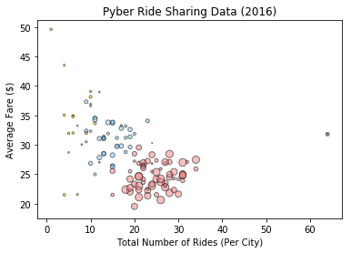

 OBSERVABLE TRENDS
    - There are more rides on Urban cities.
    - Fares are higher on Rural cities (probably because of the trip distance)
    - Most of the drivers are in the Urban cities.


```python
# Dependencies
#%matplotlib notebook
import matplotlib.pyplot as plt
import numpy as np
import pandas as pd
import seaborn as sb
```


```python
# Read CSV
city_csv = pd.read_csv('city_data.csv')
ride_csv = pd.read_csv('ride_data.csv')
city_csv.head()
```


<div>
<style scoped>
    .dataframe tbody tr th:only-of-type {
        vertical-align: middle;
    }

    .dataframe tbody tr th {
        vertical-align: top;
    }

    .dataframe thead th {
        text-align: right;
    }
</style>
<table border="1" class="dataframe">
  <thead>
    <tr style="text-align: right;">
      <th></th>
      <th>city</th>
      <th>driver_count</th>
      <th>type</th>
    </tr>
  </thead>
  <tbody>
    <tr>
      <th>0</th>
      <td>Kelseyland</td>
      <td>63</td>
      <td>Urban</td>
    </tr>
    <tr>
      <th>1</th>
      <td>Nguyenbury</td>
      <td>8</td>
      <td>Urban</td>
    </tr>
    <tr>
      <th>2</th>
      <td>East Douglas</td>
      <td>12</td>
      <td>Urban</td>
    </tr>
    <tr>
      <th>3</th>
      <td>West Dawnfurt</td>
      <td>34</td>
      <td>Urban</td>
    </tr>
    <tr>
      <th>4</th>
      <td>Rodriguezburgh</td>
      <td>52</td>
      <td>Urban</td>
    </tr>
  </tbody>
</table>
</div>


```python
ride_csv.head()
```


<div>
<style scoped>
    .dataframe tbody tr th:only-of-type {
        vertical-align: middle;
    }

    .dataframe tbody tr th {
        vertical-align: top;
    }

    .dataframe thead th {
        text-align: right;
    }
</style>
<table border="1" class="dataframe">
  <thead>
    <tr style="text-align: right;">
      <th></th>
      <th>city</th>
      <th>date</th>
      <th>fare</th>
      <th>ride_id</th>
    </tr>
  </thead>
  <tbody>
    <tr>
      <th>0</th>
      <td>Sarabury</td>
      <td>2016-01-16 13:49:27</td>
      <td>38.35</td>
      <td>5403689035038</td>
    </tr>
    <tr>
      <th>1</th>
      <td>South Roy</td>
      <td>2016-01-02 18:42:34</td>
      <td>17.49</td>
      <td>4036272335942</td>
    </tr>
    <tr>
      <th>2</th>
      <td>Wiseborough</td>
      <td>2016-01-21 17:35:29</td>
      <td>44.18</td>
      <td>3645042422587</td>
    </tr>
    <tr>
      <th>3</th>
      <td>Spencertown</td>
      <td>2016-07-31 14:53:22</td>
      <td>6.87</td>
      <td>2242596575892</td>
    </tr>
    <tr>
      <th>4</th>
      <td>Nguyenbury</td>
      <td>2016-07-09 04:42:44</td>
      <td>6.28</td>
      <td>1543057793673</td>
    </tr>
  </tbody>
</table>
</div>


```python
pyber_df = pd.merge(city_csv, ride_csv, on="city")
pyber_cities_df = pyber_df.groupby(['city'])
pyber_cities_df = pyber_cities_df.mean()
pyber_cities_df = pyber_cities_df.drop(['ride_id'],1)
pyber_cities_df.head()
```


<div>
<style scoped>
    .dataframe tbody tr th:only-of-type {
        vertical-align: middle;
    }

    .dataframe tbody tr th {
        vertical-align: top;
    }

    .dataframe thead th {
        text-align: right;
    }
</style>
<table border="1" class="dataframe">
  <thead>
    <tr style="text-align: right;">
      <th></th>
      <th>driver_count</th>
      <th>fare</th>
    </tr>
    <tr>
      <th>city</th>
      <th></th>
      <th></th>
    </tr>
  </thead>
  <tbody>
    <tr>
      <th>Alvarezhaven</th>
      <td>21.0</td>
      <td>23.928710</td>
    </tr>
    <tr>
      <th>Alyssaberg</th>
      <td>67.0</td>
      <td>20.609615</td>
    </tr>
    <tr>
      <th>Anitamouth</th>
      <td>16.0</td>
      <td>37.315556</td>
    </tr>
    <tr>
      <th>Antoniomouth</th>
      <td>21.0</td>
      <td>23.625000</td>
    </tr>
    <tr>
      <th>Aprilchester</th>
      <td>49.0</td>
      <td>21.981579</td>
    </tr>
  </tbody>
</table>
</div>


```python
total_rides_city_type = pyber_df.groupby(['type'])
total_rides_city_type = total_rides_city_type['ride_id'].count()
total_rides_city_type

# Labels for the sections of our pie chart
labels = ["Rural", "Suburban", "Urban"]

# The values of each section of the pie chart
sizes = [total_rides_city_type['Rural'], total_rides_city_type['Suburban'], total_rides_city_type['Urban'] ]

# The colors of each section of the pie chart
colors = ["gold", "lightskyblue", "lightcoral"]

# Tells matplotlib to seperate the "Python" section from the others
explode = (0, 0, 0.1)

# Creates the pie chart based upon the values above
# Automatically finds the percentages of each part of the pie chart
plt.pie(sizes, explode=explode, labels=labels, colors=colors,
        autopct="%1.1f%%", shadow=True, startangle=140)

# Tells matplotlib that we want a pie chart with equal axes
plt.axis("equal")

#Add Title to the Pie Chart
plt.title("% of Total Rides by City Type")

# Prints our pie chart to the screen
plt.show()
```


```python
total_drivers_city_type = city_csv.groupby(['type'])
total_drivers_city_type = total_drivers_city_type['driver_count'].sum()
total_drivers_city_type

# Labels for the sections of our pie chart
labels = ["Rural", "Suburban", "Urban"]

# The values of each section of the pie chart
sizes = [total_drivers_city_type['Rural'], total_drivers_city_type['Suburban'], total_drivers_city_type['Urban'] ]

# The colors of each section of the pie chart
colors = ["gold", "lightskyblue", "lightcoral"]

# Tells matplotlib to seperate the "Python" section from the others
explode = (0, 0, 0.1)

# Creates the pie chart based upon the values above
# Automatically finds the percentages of each part of the pie chart
plt.pie(sizes, explode=explode, labels=labels, colors=colors,
        autopct="%1.1f%%", shadow=True, startangle=140)

# Tells matplotlib that we want a pie chart with equal axes
plt.axis("equal")

#Add Title to the Pie Chart
plt.title("% of Total Drivers by City Type")

# Prints our pie chart to the screen
plt.show()
```


```python
total_fare_city_type = pyber_df.groupby(['type'])
total_fare_city_type = total_fare_city_type['fare'].sum()
total_fare_city_type

# Labels for the sections of our pie chart
labels = ["Rural", "Suburban", "Urban"]

# The values of each section of the pie chart
sizes = [total_fare_city_type['Rural'], total_fare_city_type['Suburban'], total_fare_city_type['Urban'] ]

# The colors of each section of the pie chart
colors = ["gold", "lightskyblue", "lightcoral"]

# Tells matplotlib to seperate the "Python" section from the others
explode = (0, 0, 0.1)

# Creates the pie chart based upon the values above
# Automatically finds the percentages of each part of the pie chart
plt.pie(sizes, explode=explode, labels=labels, colors=colors,
        autopct="%1.1f%%", shadow=True, startangle=140)

# Tells matplotlib that we want a pie chart with equal axes
plt.axis("equal")

#Add Title to the Pie Chart
plt.title("% of Total Fares by City Type")

# Prints our pie chart to the screen
plt.show()
```


```python

avg_fare_city = pyber_df
avg_fare_city['type'] = avg_fare_city['type'].replace({"Rural":0,"Suburban":1,"Urban":2})
avg_fare_city['type'] = avg_fare_city['type'].astype(int)
avg_fare_city = avg_fare_city.groupby(['city'])
avg_fare_city = avg_fare_city['fare'].mean()
avg_fare_city.head()
```


    city
    Alvarezhaven    23.928710
    Alyssaberg      20.609615
    Anitamouth      37.315556
    Antoniomouth    23.625000
    Aprilchester    21.981579
    Name: fare, dtype: float64


```python
rides_per_city = pyber_df 
#rides_per_city['type'] = rides_per_city['type'].replace({"Rural":0,"Suburban":1,"Urban":2})
#rides_per_city['type'] = rides_per_city['type'].astype(int)
rides_per_city = rides_per_city.groupby(['city'])
rides_per_city = rides_per_city['ride_id'].count()
rides_per_city.head()
```


    city
    Alvarezhaven    31
    Alyssaberg      26
    Anitamouth       9
    Antoniomouth    22
    Aprilchester    19
    Name: ride_id, dtype: int64


```python
drivers_per_city = pyber_df
#drivers_per_city['type'] = drivers_per_city['type'].replace({"Rural":0,"Suburban":1,"Urban":2})
#drivers_per_city['type'] = drivers_per_city['type'].astype(int)
drivers_per_city = drivers_per_city.groupby(['city'])
drivers_per_city = drivers_per_city['driver_count'].mean()
drivers_per_city.head()
#city_list = pyber_df
#city_list['type'] = city_list['type'].replace({"Rural":"0","Suburban":"1","Urban":"2"})
#city_list['type'] = city_list['type'].astype(int)
```


    city
    Alvarezhaven    21
    Alyssaberg      67
    Anitamouth      16
    Antoniomouth    21
    Aprilchester    49
    Name: driver_count, dtype: int64


```python
#city_type = pyber_df 
#city_type = city_type.groupby(['city'])
#city_type = city_type['type'].loc()
#city_type.head()
```


```python
pyber_type_df = pyber_cities_df.merge(rides_per_city.to_frame(), left_index=True, right_index=True)
pyber_type_df = pyber_type_df.merge(city_csv, left_index=True, right_on="city")
pyber_type_df = pyber_type_df.drop('driver_count_x', 1)
pyber_type_df = pyber_type_df.set_index('city')
pyber_type_df.head()
```


<div>
<style scoped>
    .dataframe tbody tr th:only-of-type {
        vertical-align: middle;
    }

    .dataframe tbody tr th {
        vertical-align: top;
    }

    .dataframe thead th {
        text-align: right;
    }
</style>
<table border="1" class="dataframe">
  <thead>
    <tr style="text-align: right;">
      <th></th>
      <th>fare</th>
      <th>ride_id</th>
      <th>driver_count_y</th>
      <th>type</th>
    </tr>
    <tr>
      <th>city</th>
      <th></th>
      <th></th>
      <th></th>
      <th></th>
    </tr>
  </thead>
  <tbody>
    <tr>
      <th>Alvarezhaven</th>
      <td>23.928710</td>
      <td>31</td>
      <td>21</td>
      <td>Urban</td>
    </tr>
    <tr>
      <th>Alyssaberg</th>
      <td>20.609615</td>
      <td>26</td>
      <td>67</td>
      <td>Urban</td>
    </tr>
    <tr>
      <th>Anitamouth</th>
      <td>37.315556</td>
      <td>9</td>
      <td>16</td>
      <td>Suburban</td>
    </tr>
    <tr>
      <th>Antoniomouth</th>
      <td>23.625000</td>
      <td>22</td>
      <td>21</td>
      <td>Urban</td>
    </tr>
    <tr>
      <th>Aprilchester</th>
      <td>21.981579</td>
      <td>19</td>
      <td>49</td>
      <td>Urban</td>
    </tr>
  </tbody>
</table>
</div>


```python
rural_df = pyber_type_df.loc[pyber_type_df['type'] == 'Rural']
rural_df
suburban_df = pyber_type_df.loc[pyber_type_df['type'] == 'Suburban']
suburban_df
urban_df = pyber_type_df.loc[pyber_type_df['type'] == 'Urban']
urban_df.head()
```


<div>
<style scoped>
    .dataframe tbody tr th:only-of-type {
        vertical-align: middle;
    }

    .dataframe tbody tr th {
        vertical-align: top;
    }

    .dataframe thead th {
        text-align: right;
    }
</style>
<table border="1" class="dataframe">
  <thead>
    <tr style="text-align: right;">
      <th></th>
      <th>fare</th>
      <th>ride_id</th>
      <th>driver_count_y</th>
      <th>type</th>
    </tr>
    <tr>
      <th>city</th>
      <th></th>
      <th></th>
      <th></th>
      <th></th>
    </tr>
  </thead>
  <tbody>
    <tr>
      <th>Alvarezhaven</th>
      <td>23.928710</td>
      <td>31</td>
      <td>21</td>
      <td>Urban</td>
    </tr>
    <tr>
      <th>Alyssaberg</th>
      <td>20.609615</td>
      <td>26</td>
      <td>67</td>
      <td>Urban</td>
    </tr>
    <tr>
      <th>Antoniomouth</th>
      <td>23.625000</td>
      <td>22</td>
      <td>21</td>
      <td>Urban</td>
    </tr>
    <tr>
      <th>Aprilchester</th>
      <td>21.981579</td>
      <td>19</td>
      <td>49</td>
      <td>Urban</td>
    </tr>
    <tr>
      <th>Arnoldview</th>
      <td>25.106452</td>
      <td>31</td>
      <td>41</td>
      <td>Urban</td>
    </tr>
  </tbody>
</table>
</div>


```python
#citylist['type'] = citylist['type'].replace({'Rural':'1','Suburban':'2', 'Urban':'3'})

#urbanlist =

#urban_list = pyber_df.groupby(['type'])
#urban_list 
#loc[city_list['type'] == 0]

# create data
x = rural_df['ride_id']
y = rural_df['fare']
a = suburban_df['ride_id']
b = suburban_df['fare']
c = urban_df['ride_id']
d = urban_df['fare']


 
# use the scatter function
plt.scatter(x, y, s= rural_df['driver_count_y'], c="gold", alpha=0.5, edgecolors = "black", linewidth=1)
plt.scatter(a, b, s= suburban_df['driver_count_y'], c="lightskyblue", alpha=0.5, edgecolors = "black", linewidth=1)
plt.scatter(c, d, s= urban_df['driver_count_y'], c="lightcoral", alpha=0.5, edgecolors = "black", linewidth=1)


plt.title("Pyber Ride Sharing Data (2016)")
plt.xlabel("Total Number of Rides (Per City)")
plt.ylabel("Average Fare ($)")
#plt.legend([0,1,2], (city_list.index.values))
#,('Rural','Suburban','Urban'))
plt.show()

#["Rural","Suburban","Urban"]
```




