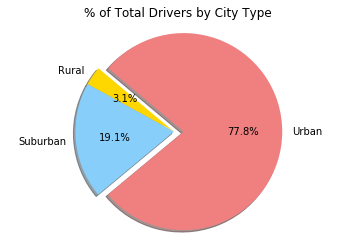
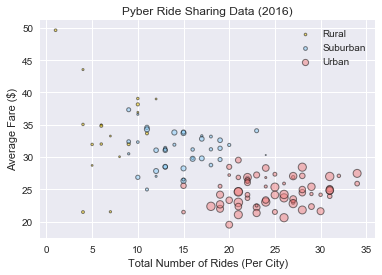

# Pyber

## Data Analysis on a ride sharing application using Pandas and Matplotlib.
#### *Project created as part of GWU Data Analytics course.*
> Pandas, Python, Matplotlib

## Objective

Seeing the success of notable players like Uber and Lyft, you've decided to join a fledgling ride sharing company of your own. In your latest capacity, you'll be acting as Chief Data Strategist for the company. In this role, you'll be expected to offer data-backed guidance on new opportunities for market differentiation.

You've since been given access to the company's complete recordset of rides. This contains information about every active driver and historic ride, including details like city, driver count, individual fares, and city type.

Your objective is to build a Bubble Plot that showcases the relationship between four key variables:


Average Fare ($) Per City
Total Number of Rides Per City
Total Number of Drivers Per City
City Type (Urban, Suburban, Rural)


In addition, you will be expected to produce the following three pie charts:


% of Total Fares by City Type
% of Total Rides by City Type
% of Total Drivers by City Type

## Data Source

## Coding


```python
# Dependencies
#%matplotlib notebook
import matplotlib.pyplot as plt
import numpy as np
import pandas as pd
import seaborn as sb
```


```python
# Read CSV
city_csv = pd.read_csv('city_data.csv')
ride_csv = pd.read_csv('ride_data.csv')
city_csv.head()
```


<div>
<table class="dataframe">
  <thead>
    <tr style="text-align: right;">
      <th></th>
      <th>city</th>
      <th>driver_count</th>
      <th>type</th>
    </tr>
  </thead>
  <tbody>
    <tr>
      <th>0</th>
      <td>Kelseyland</td>
      <td>63</td>
      <td>Urban</td>
    </tr>
    <tr>
      <th>1</th>
      <td>Nguyenbury</td>
      <td>8</td>
      <td>Urban</td>
    </tr>
    <tr>
      <th>2</th>
      <td>East Douglas</td>
      <td>12</td>
      <td>Urban</td>
    </tr>
    <tr>
      <th>3</th>
      <td>West Dawnfurt</td>
      <td>34</td>
      <td>Urban</td>
    </tr>
    <tr>
      <th>4</th>
      <td>Rodriguezburgh</td>
      <td>52</td>
      <td>Urban</td>
    </tr>
  </tbody>
</table>
</div>


```python
ride_csv.head()
```


<div>
<table class="dataframe">
  <thead>
    <tr style="text-align: right;">
      <th></th>
      <th>city</th>
      <th>date</th>
      <th>fare</th>
      <th>ride_id</th>
    </tr>
  </thead>
  <tbody>
    <tr>
      <th>0</th>
      <td>Sarabury</td>
      <td>2016-01-16 13:49:27</td>
      <td>38.35</td>
      <td>5403689035038</td>
    </tr>
    <tr>
      <th>1</th>
      <td>South Roy</td>
      <td>2016-01-02 18:42:34</td>
      <td>17.49</td>
      <td>4036272335942</td>
    </tr>
    <tr>
      <th>2</th>
      <td>Wiseborough</td>
      <td>2016-01-21 17:35:29</td>
      <td>44.18</td>
      <td>3645042422587</td>
    </tr>
    <tr>
      <th>3</th>
      <td>Spencertown</td>
      <td>2016-07-31 14:53:22</td>
      <td>6.87</td>
      <td>2242596575892</td>
    </tr>
    <tr>
      <th>4</th>
      <td>Nguyenbury</td>
      <td>2016-07-09 04:42:44</td>
      <td>6.28</td>
      <td>1543057793673</td>
    </tr>
  </tbody>
</table>
</div>


```python
pyber_df = pd.merge(city_csv, ride_csv, on="city")
pyber_cities_df = pyber_df.groupby(['city'])
pyber_cities_df = pyber_cities_df.mean()
pyber_cities_df = pyber_cities_df.drop(['ride_id'],1)
pyber_cities_df.head()
```


<div>
<table class="dataframe">
  <thead>
    <tr style="text-align: right;">
      <th></th>
      <th>driver_count</th>
      <th>fare</th>
    </tr>
    <tr>
      <th>city</th>
      <th></th>
      <th></th>
    </tr>
  </thead>
  <tbody>
    <tr>
      <th>Alvarezhaven</th>
      <td>21.0</td>
      <td>23.928710</td>
    </tr>
    <tr>
      <th>Alyssaberg</th>
      <td>67.0</td>
      <td>20.609615</td>
    </tr>
    <tr>
      <th>Anitamouth</th>
      <td>16.0</td>
      <td>37.315556</td>
    </tr>
    <tr>
      <th>Antoniomouth</th>
      <td>21.0</td>
      <td>23.625000</td>
    </tr>
    <tr>
      <th>Aprilchester</th>
      <td>49.0</td>
      <td>21.981579</td>
    </tr>
  </tbody>
</table>
</div>


```python
total_rides_city_type = pyber_df.groupby(['type'])
total_rides_city_type = total_rides_city_type['ride_id'].count()
total_rides_city_type

# Labels for the sections of our pie chart
labels = ["Rural", "Suburban", "Urban"]

# The values of each section of the pie chart
sizes = [total_rides_city_type['Rural'], total_rides_city_type['Suburban'], total_rides_city_type['Urban'] ]

# The colors of each section of the pie chart
colors = ["gold", "lightskyblue", "lightcoral"]

# Tells matplotlib to seperate the "Python" section from the others
explode = (0, 0, 0.1)

# Creates the pie chart based upon the values above
# Automatically finds the percentages of each part of the pie chart
plt.pie(sizes, explode=explode, labels=labels, colors=colors,
        autopct="%1.1f%%", shadow=True, startangle=140)

# Tells matplotlib that we want a pie chart with equal axes
plt.axis("equal")

#Add Title to the Pie Chart
plt.title("% of Total Rides by City Type")

# Prints our pie chart to the screen
plt.show()
```


```python
total_drivers_city_type = city_csv.groupby(['type'])
total_drivers_city_type = total_drivers_city_type['driver_count'].sum()
total_drivers_city_type

# Labels for the sections of our pie chart
labels = ["Rural", "Suburban", "Urban"]

# The values of each section of the pie chart
sizes = [total_drivers_city_type['Rural'], total_drivers_city_type['Suburban'], total_drivers_city_type['Urban'] ]

# The colors of each section of the pie chart
colors = ["gold", "lightskyblue", "lightcoral"]

# Tells matplotlib to seperate the "Python" section from the others
explode = (0, 0, 0.1)

# Creates the pie chart based upon the values above
# Automatically finds the percentages of each part of the pie chart
plt.pie(sizes, explode=explode, labels=labels, colors=colors,
        autopct="%1.1f%%", shadow=True, startangle=140)

# Tells matplotlib that we want a pie chart with equal axes
plt.axis("equal")

#Add Title to the Pie Chart
plt.title("% of Total Drivers by City Type")

# Prints our pie chart to the screen
plt.show()
```





```python
total_fare_city_type = pyber_df.groupby(['type'])
total_fare_city_type = total_fare_city_type['fare'].sum()
total_fare_city_type

# Labels for the sections of our pie chart
labels = ["Rural", "Suburban", "Urban"]

# The values of each section of the pie chart
sizes = [total_fare_city_type['Rural'], total_fare_city_type['Suburban'], total_fare_city_type['Urban'] ]

# The colors of each section of the pie chart
colors = ["gold", "lightskyblue", "lightcoral"]

# Tells matplotlib to seperate the "Python" section from the others
explode = (0, 0, 0.1)

# Creates the pie chart based upon the values above
# Automatically finds the percentages of each part of the pie chart
plt.pie(sizes, explode=explode, labels=labels, colors=colors,
        autopct="%1.1f%%", shadow=True, startangle=140)

# Tells matplotlib that we want a pie chart with equal axes
plt.axis("equal")

#Add Title to the Pie Chart
plt.title("% of Total Fares by City Type")

# Prints our pie chart to the screen
plt.show()
```


```python

avg_fare_city = pyber_df
avg_fare_city['type'] = avg_fare_city['type'].replace({"Rural":0,"Suburban":1,"Urban":2})
avg_fare_city['type'] = avg_fare_city['type'].astype(int)
avg_fare_city = avg_fare_city.groupby(['city'])
avg_fare_city = avg_fare_city['fare'].mean()
avg_fare_city.head()
```


    city
    Alvarezhaven    23.928710
    Alyssaberg      20.609615
    Anitamouth      37.315556
    Antoniomouth    23.625000
    Aprilchester    21.981579
    Name: fare, dtype: float64


```python
rides_per_city = pyber_df 
#rides_per_city['type'] = rides_per_city['type'].replace({"Rural":0,"Suburban":1,"Urban":2})
#rides_per_city['type'] = rides_per_city['type'].astype(int)
rides_per_city = rides_per_city.groupby(['city'])
rides_per_city = rides_per_city['ride_id'].count()
rides_per_city.head()
```


    city
    Alvarezhaven    31
    Alyssaberg      26
    Anitamouth       9
    Antoniomouth    22
    Aprilchester    19
    Name: ride_id, dtype: int64


```python
drivers_per_city = pyber_df
#drivers_per_city['type'] = drivers_per_city['type'].replace({"Rural":0,"Suburban":1,"Urban":2})
#drivers_per_city['type'] = drivers_per_city['type'].astype(int)
drivers_per_city = drivers_per_city.groupby(['city'])
drivers_per_city = drivers_per_city['driver_count'].mean()
drivers_per_city.head()
```


    city
    Alvarezhaven    21
    Alyssaberg      67
    Anitamouth      16
    Antoniomouth    21
    Aprilchester    49
    Name: driver_count, dtype: int64


```python
pyber_type_df = pyber_cities_df.merge(rides_per_city.to_frame(), left_index=True, right_index=True)
pyber_type_df = pyber_type_df.merge(city_csv, left_index=True, right_on="city")
pyber_type_df = pyber_type_df.drop('driver_count_x', 1)
pyber_type_df = pyber_type_df.set_index('city')
pyber_type_df = pyber_type_df.rename(index=str, columns={"ride_id": "rides", "driver_count_y": "drivers"})
pyber_type_df = pyber_type_df.drop([0,"Port James"])
pyber_type_df.head()
```


<div>
<table class="dataframe">
  <thead>
    <tr style="text-align: right;">
      <th></th>
      <th>fare</th>
      <th>rides</th>
      <th>drivers</th>
      <th>type</th>
    </tr>
    <tr>
      <th>city</th>
      <th></th>
      <th></th>
      <th></th>
      <th></th>
    </tr>
  </thead>
  <tbody>
    <tr>
      <th>Alvarezhaven</th>
      <td>23.928710</td>
      <td>31</td>
      <td>21</td>
      <td>Urban</td>
    </tr>
    <tr>
      <th>Alyssaberg</th>
      <td>20.609615</td>
      <td>26</td>
      <td>67</td>
      <td>Urban</td>
    </tr>
    <tr>
      <th>Anitamouth</th>
      <td>37.315556</td>
      <td>9</td>
      <td>16</td>
      <td>Suburban</td>
    </tr>
    <tr>
      <th>Antoniomouth</th>
      <td>23.625000</td>
      <td>22</td>
      <td>21</td>
      <td>Urban</td>
    </tr>
    <tr>
      <th>Aprilchester</th>
      <td>21.981579</td>
      <td>19</td>
      <td>49</td>
      <td>Urban</td>
    </tr>
    <tr>
      <th>Arnoldview</th>
      <td>25.106452</td>
      <td>31</td>
      <td>41</td>
      <td>Urban</td>
    </tr>
    <tr>
      <th>Campbellport</th>
      <td>33.711333</td>
      <td>15</td>
      <td>26</td>
      <td>Suburban</td>
    </tr>
    <tr>
      <th>Carrollbury</th>
      <td>36.606000</td>
      <td>10</td>
      <td>4</td>
      <td>Suburban</td>
    </tr>
    <tr>
      <th>Carrollfort</th>
      <td>25.395517</td>
      <td>29</td>
      <td>55</td>
      <td>Urban</td>
    </tr>
    <tr>
      <th>Clarkstad</th>
      <td>31.051667</td>
      <td>12</td>
      <td>21</td>
      <td>Suburban</td>
    </tr>
    <tr>
      <th>Conwaymouth</th>
      <td>34.591818</td>
      <td>11</td>
      <td>18</td>
      <td>Suburban</td>
    </tr>
    <tr>
      <th>Davidtown</th>
      <td>22.978095</td>
      <td>21</td>
      <td>73</td>
      <td>Urban</td>
    </tr>
    <tr>
      <th>Davistown</th>
      <td>21.497200</td>
      <td>25</td>
      <td>25</td>
      <td>Urban</td>
    </tr>
    <tr>
      <th>East Cherylfurt</th>
      <td>31.416154</td>
      <td>13</td>
      <td>9</td>
      <td>Suburban</td>
    </tr>
    <tr>
      <th>East Douglas</th>
      <td>26.169091</td>
      <td>22</td>
      <td>12</td>
      <td>Urban</td>
    </tr>
    <tr>
      <th>East Erin</th>
      <td>24.478214</td>
      <td>28</td>
      <td>43</td>
      <td>Urban</td>
    </tr>
    <tr>
      <th>East Jenniferchester</th>
      <td>32.599474</td>
      <td>19</td>
      <td>22</td>
      <td>Suburban</td>
    </tr>
    <tr>
      <th>East Leslie</th>
      <td>33.660909</td>
      <td>11</td>
      <td>9</td>
      <td>Rural</td>
    </tr>
    <tr>
      <th>East Stephen</th>
      <td>39.053000</td>
      <td>10</td>
      <td>6</td>
      <td>Rural</td>
    </tr>
    <tr>
      <th>East Troybury</th>
      <td>33.244286</td>
      <td>7</td>
      <td>3</td>
      <td>Rural</td>
    </tr>
    <tr>
      <th>Edwardsbury</th>
      <td>26.876667</td>
      <td>27</td>
      <td>11</td>
      <td>Urban</td>
    </tr>
    <tr>
      <th>Erikport</th>
      <td>30.043750</td>
      <td>8</td>
      <td>3</td>
      <td>Rural</td>
    </tr>
    <tr>
      <th>Eriktown</th>
      <td>25.478947</td>
      <td>19</td>
      <td>15</td>
      <td>Urban</td>
    </tr>
    <tr>
      <th>Floresberg</th>
      <td>32.310000</td>
      <td>10</td>
      <td>7</td>
      <td>Suburban</td>
    </tr>
    <tr>
      <th>Fosterside</th>
      <td>23.034583</td>
      <td>24</td>
      <td>69</td>
      <td>Urban</td>
    </tr>
    <tr>
      <th>Hernandezshire</th>
      <td>32.002222</td>
      <td>9</td>
      <td>10</td>
      <td>Rural</td>
    </tr>
    <tr>
      <th>Horneland</th>
      <td>21.482500</td>
      <td>4</td>
      <td>8</td>
      <td>Rural</td>
    </tr>
    <tr>
      <th>Jacksonfort</th>
      <td>32.006667</td>
      <td>6</td>
      <td>6</td>
      <td>Rural</td>
    </tr>
    <tr>
      <th>Jacobfort</th>
      <td>24.779355</td>
      <td>31</td>
      <td>52</td>
      <td>Urban</td>
    </tr>
    <tr>
      <th>Jasonfort</th>
      <td>27.831667</td>
      <td>12</td>
      <td>25</td>
      <td>Suburban</td>
    </tr>
    <tr>
      <th>...</th>
      <td>...</td>
      <td>...</td>
      <td>...</td>
      <td>...</td>
    </tr>
    <tr>
      <th>Port Alexandria</th>
      <td>26.316667</td>
      <td>15</td>
      <td>27</td>
      <td>Suburban</td>
    </tr>
    <tr>
      <th>Port Guytown</th>
      <td>28.242000</td>
      <td>15</td>
      <td>26</td>
      <td>Suburban</td>
    </tr>
    <tr>
      <th>Port Johnstad</th>
      <td>25.882941</td>
      <td>34</td>
      <td>22</td>
      <td>Urban</td>
    </tr>
    <tr>
      <th>Port Jose</th>
      <td>31.193889</td>
      <td>18</td>
      <td>11</td>
      <td>Suburban</td>
    </tr>
    <tr>
      <th>Port Josephfurt</th>
      <td>26.367727</td>
      <td>22</td>
      <td>28</td>
      <td>Urban</td>
    </tr>
    <tr>
      <th>Port Martinberg</th>
      <td>22.329524</td>
      <td>21</td>
      <td>44</td>
      <td>Urban</td>
    </tr>
    <tr>
      <th>Port Michelleview</th>
      <td>26.720000</td>
      <td>22</td>
      <td>16</td>
      <td>Suburban</td>
    </tr>
    <tr>
      <th>Port Samantha</th>
      <td>27.047407</td>
      <td>27</td>
      <td>55</td>
      <td>Urban</td>
    </tr>
    <tr>
      <th>Prattfurt</th>
      <td>23.346667</td>
      <td>24</td>
      <td>43</td>
      <td>Urban</td>
    </tr>
    <tr>
      <th>Rodriguezburgh</th>
      <td>21.332609</td>
      <td>23</td>
      <td>52</td>
      <td>Urban</td>
    </tr>
    <tr>
      <th>Rodriguezview</th>
      <td>31.866500</td>
      <td>20</td>
      <td>10</td>
      <td>Suburban</td>
    </tr>
    <tr>
      <th>Russellport</th>
      <td>22.486087</td>
      <td>23</td>
      <td>9</td>
      <td>Urban</td>
    </tr>
    <tr>
      <th>Sandymouth</th>
      <td>23.105926</td>
      <td>27</td>
      <td>11</td>
      <td>Urban</td>
    </tr>
    <tr>
      <th>Sarabury</th>
      <td>23.490000</td>
      <td>27</td>
      <td>46</td>
      <td>Urban</td>
    </tr>
    <tr>
      <th>Sarahview</th>
      <td>33.862000</td>
      <td>15</td>
      <td>18</td>
      <td>Suburban</td>
    </tr>
    <tr>
      <th>Shelbyhaven</th>
      <td>34.828333</td>
      <td>6</td>
      <td>9</td>
      <td>Rural</td>
    </tr>
    <tr>
      <th>Smithhaven</th>
      <td>22.788889</td>
      <td>27</td>
      <td>67</td>
      <td>Urban</td>
    </tr>
    <tr>
      <th>South Bryanstad</th>
      <td>24.598571</td>
      <td>21</td>
      <td>73</td>
      <td>Urban</td>
    </tr>
    <tr>
      <th>South Elizabethmouth</th>
      <td>28.698000</td>
      <td>5</td>
      <td>3</td>
      <td>Rural</td>
    </tr>
    <tr>
      <th>South Gracechester</th>
      <td>31.345789</td>
      <td>19</td>
      <td>19</td>
      <td>Suburban</td>
    </tr>
    <tr>
      <th>South Jennifer</th>
      <td>29.798750</td>
      <td>16</td>
      <td>6</td>
      <td>Suburban</td>
    </tr>
    <tr>
      <th>South Joseph</th>
      <td>38.983333</td>
      <td>12</td>
      <td>3</td>
      <td>Rural</td>
    </tr>
    <tr>
      <th>South Josephville</th>
      <td>26.823750</td>
      <td>24</td>
      <td>4</td>
      <td>Urban</td>
    </tr>
    <tr>
      <th>South Louis</th>
      <td>27.087500</td>
      <td>32</td>
      <td>12</td>
      <td>Urban</td>
    </tr>
    <tr>
      <th>South Roy</th>
      <td>26.031364</td>
      <td>22</td>
      <td>35</td>
      <td>Urban</td>
    </tr>
    <tr>
      <th>South Shannonborough</th>
      <td>26.516667</td>
      <td>15</td>
      <td>9</td>
      <td>Suburban</td>
    </tr>
    <tr>
      <th>Spencertown</th>
      <td>23.681154</td>
      <td>26</td>
      <td>68</td>
      <td>Urban</td>
    </tr>
    <tr>
      <th>Stevensport</th>
      <td>31.948000</td>
      <td>5</td>
      <td>6</td>
      <td>Rural</td>
    </tr>
    <tr>
      <th>Stewartview</th>
      <td>21.614000</td>
      <td>30</td>
      <td>49</td>
      <td>Urban</td>
    </tr>
    <tr>
      <th>Swansonbury</th>
      <td>27.464706</td>
      <td>34</td>
      <td>64</td>
      <td>Urban</td>
    </tr>
  </tbody>
</table>
<p>100 rows × 4 columns</p>
</div>


```python
rural_df = pyber_type_df.loc[pyber_type_df['type'] == 'Rural']
suburban_df = pyber_type_df.loc[pyber_type_df['type'] == 'Suburban']
urban_df = pyber_type_df.loc[pyber_type_df['type'] == 'Urban']
urban_df.head()
```


<div>
<table class="dataframe">
  <thead>
    <tr style="text-align: right;">
      <th></th>
      <th>fare</th>
      <th>rides</th>
      <th>drivers</th>
      <th>type</th>
    </tr>
    <tr>
      <th>city</th>
      <th></th>
      <th></th>
      <th></th>
      <th></th>
    </tr>
  </thead>
  <tbody>
    <tr>
      <th>Alvarezhaven</th>
      <td>23.928710</td>
      <td>31</td>
      <td>21</td>
      <td>Urban</td>
    </tr>
    <tr>
      <th>Alyssaberg</th>
      <td>20.609615</td>
      <td>26</td>
      <td>67</td>
      <td>Urban</td>
    </tr>
    <tr>
      <th>Antoniomouth</th>
      <td>23.625000</td>
      <td>22</td>
      <td>21</td>
      <td>Urban</td>
    </tr>
    <tr>
      <th>Aprilchester</th>
      <td>21.981579</td>
      <td>19</td>
      <td>49</td>
      <td>Urban</td>
    </tr>
    <tr>
      <th>Arnoldview</th>
      <td>25.106452</td>
      <td>31</td>
      <td>41</td>
      <td>Urban</td>
    </tr>
  </tbody>
</table>
</div>


```python
# create data
x = rural_df['rides']
y = rural_df['fare']
a = suburban_df['rides']
b = suburban_df['fare']
c = urban_df['rides']
d = urban_df['fare']

 
# use the scatter function
plt.scatter(x, y, s= rural_df['drivers'], c="gold", label="Rural", alpha=0.5, edgecolors = "black", linewidth=1)
plt.scatter(a, b, s= suburban_df['drivers'], c="lightskyblue", label="Suburban", alpha=0.5, edgecolors = "black", linewidth=1)
plt.scatter(c, d, s= urban_df['drivers'], c="lightcoral", label="Urban", alpha=0.5, edgecolors = "black", linewidth=1)

plt.title("Pyber Ride Sharing Data (2016)")
plt.xlabel("Total Number of Rides (Per City)")
plt.ylabel("Average Fare ($)")
plt.legend()
sb.axes_style("darkgrid")
plt.show()

```





## Data Analysis

### Observable Trends
   * There are more rides on Urban cities.
   * Fares are higher on Rural cities (probably because of the trip distance)
   * Most of the drivers are in the Urban cities.
